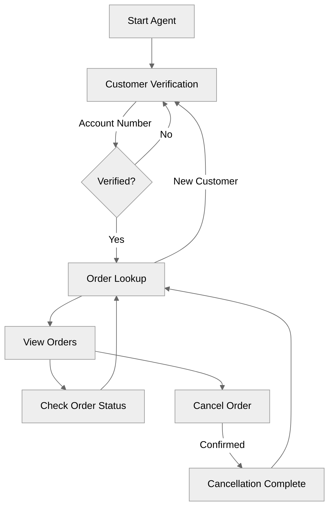

# Order Management

## Overview

This recipe demonstrates a multi-topic order management agent that gates all operations behind customer verification. It shows how to use Apex invocable classes as action targets, enforce a verification-first workflow using topic transitions, and support order lookup, status checking, and cancellation through separate topics.

## Agent Flow



## Key Concepts

- **Verification-Gated Workflow**: All order operations require a verified customer, enforced through topic transitions
- **Apex Invocable Actions**: Three Apex classes (`CustomerVerificationService`, `OrderLookupService`, `OrderCancellationService`) exposed via `@InvocableMethod` and targeted with `apex://`
- **Multi-Topic Navigation**: Four topics with directional transitions (verification -> lookup -> status/cancellation)
- **State Management**: Mutable variables track verification status, customer data, and order state across topics
- **Bulkified Apex**: All service classes handle bulk requests with SOQL outside loops and `USER_MODE` access

## How It Works

### Customer Verification

The agent starts by routing to the `verification` topic. The customer provides an account number, which is passed to `CustomerVerificationService` via an `apex://` target. On success, the customer's name, email, and ID are stored in mutable variables.

```agentscript
verify: @actions.verify_customer
   available when not @variables.customer_verified
   with account_number=...
   set @variables.customer_verified = @outputs.success
   set @variables.customer_name = @outputs.customer_name
```

The `after_reasoning` block automatically transitions to order lookup once verified:

```agentscript
after_reasoning:
   if @variables.customer_verified:
      transition to @topic.order_lookup
```

### Order Lookup

Once verified, the `order_lookup` topic calls `OrderLookupService` with the customer's Salesforce ID. The service queries all orders and returns a formatted summary. From here, the agent can navigate to status or cancellation topics.

### Order Cancellation

The `order_cancellation` topic uses `OrderCancellationService`, which validates the order exists and is in a cancellable state before processing. Orders in `Activated` or `Cancelled` status are rejected with a descriptive error.

## Key Code Snippets

### Apex Invocable Action Target

```agentscript
actions:
   verify_customer:
      description: "Verify a customer by their account number"
      inputs:
         account_number: string
            description: "The customer's unique account number"
      outputs:
         success: boolean
         customer_name: string
         customer_email: string
         customer_id: string
         error_message: string
      target: "apex://CustomerVerificationService"
```

### Conditional Topic Transitions

```agentscript
reasoning:
   actions:
      check_status: @utils.transition to @topic.order_status
         description: "Check detailed status for a specific order"
         available when @variables.order_count > 0

      cancel_order: @utils.transition to @topic.order_cancellation
         description: "Cancel a specific order"
         available when @variables.order_count > 0
```

### Verification Gate with after_reasoning

```agentscript
after_reasoning:
   if @variables.customer_verified:
      transition to @topic.order_lookup
```

## Try It Out

### Example Interaction

```text
Agent: Welcome to Order Management! I can help you look up orders, check order status, and process cancellations. Let's start by verifying the customer.

User: I need to check on a customer's orders. Their account number is ACC-001.

Agent: Customer verified: Acme Corporation. Found 3 order(s) for this customer.

Order 00000101 | Status: Draft | Amount: $1,500.00 | Date: 2025-01-15
Order 00000102 | Status: Draft | Amount: $750.00 | Date: 2025-02-01
Order 00000103 | Status: Activated | Amount: $3,200.00 | Date: 2025-03-10

What would you like to do?

User: Cancel order 00000101. The customer changed their mind.

Agent: Order 00000101 has been cancelled successfully. Is there anything else?

User: Can you check a different customer? Account number ACC-002.

Agent: Customer verified: Global Industries. Found 1 order(s) for this customer.
```

## What's Next

- **CustomerServiceAgent**: A broader customer service agent with issue classification and escalation
- **ErrorHandling**: Patterns for handling action failures gracefully
- **MultiTopicNavigation**: More navigation patterns between topics
- **ExternalAPIIntegration**: Calling external APIs from agent actions

## Testing

Run the Apex test classes to verify the services:

- `CustomerVerificationServiceTest` - Tests account number verification with valid, invalid, blank, and bulk scenarios
- `OrderLookupServiceTest` - Tests order retrieval with valid IDs, empty results, invalid formats, and bulk requests
- `OrderCancellationServiceTest` - Tests cancellation with valid orders, non-cancellable statuses, missing data, and bulk requests
